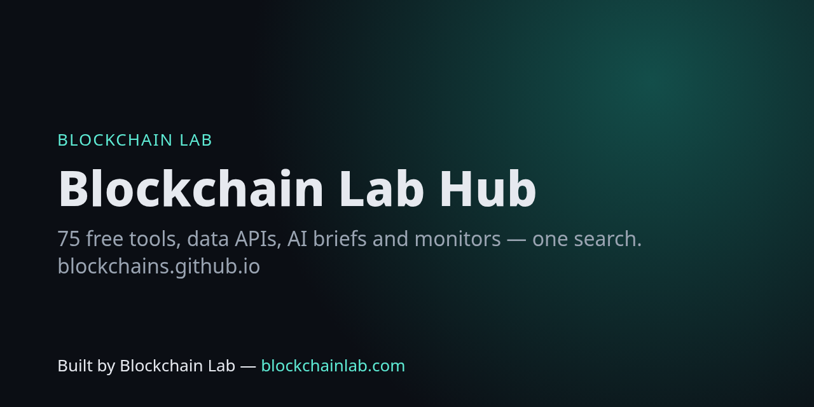

# Blockchain Lab Hub — blockchains.github.io

[](https://blockchains.github.io/status/)
[](https://github.com/Blockchains/blockchains.github.io/actions/workflows/ci.yml)
[](https://github.com/Blockchains/blockchains.github.io/actions/workflows/monitors.yml)

**One search for 75 free blockchain services**: browser tools, JSON data APIs, AI briefs (Grok), monitors, feeds and developer kits. Every service is health-checked and shows a live status badge. → **https://blockchains.github.io**



| Category | # | Highlights |
|---|---|---|
| 🤖 AI (Grok, precomputed in Actions) | 8 | [Daily market brief](https://blockchains.github.io/ai/brief/) · [incident explainer](https://blockchains.github.io/ai/incidents/) · [hackathon ideas](https://blockchains.github.io/ai/ideas/) · [chain digest](https://blockchains.github.io/ai/digest/) · [protocol briefs](https://blockchains.github.io/ai/protocols/) · [contract explainer](https://blockchains.github.io/ai/contracts/) · [audit-checklist reports](https://blockchains.github.io/ai/audits/) · [whitepaper summaries](https://blockchains.github.io/ai/whitepapers/) |
| 📡 Monitors | 7 | [Gas tracker + alerts](https://blockchains.github.io/gas/) · [chain liveness](https://blockchains.github.io/chains/) · [RPC leaderboard](https://blockchains.github.io/rpc/) · [stablecoin depeg](https://blockchains.github.io/depeg/) · [Slither security scan](https://blockchains.github.io/scan/) · [incident feed](https://blockchains.github.io/incidents/) · [site status](https://blockchains.github.io/sites-monitor/) |
| 🔎 Finders | 8 | [Portfolio viewer](https://blockchains.github.io/portfolio/) · [protocol compare](https://blockchains.github.io/compare/) · [events](https://blockchains.github.io/events/) · [jobs](https://blockchains.github.io/jobs/) · [grants](https://blockchains.github.io/grants/) · [glossary](https://blockchains.github.io/glossary/) · [papers](https://blockchains.github.io/papers/) · [phishing checker](https://blockchains.github.io/phishing/) |
| 📰 Feeds | 2 | [Incident RSS](https://blockchains.github.io/incidents/feed.xml) · [events ICS](https://blockchains.github.io/events/events.ics) |
| 🛠 Tools | 26 | [blockchainlab-tools](https://blockchains.github.io/blockchainlab-tools/) |
| 📦 Data API | 20 | [blockchainlab-api](https://blockchains.github.io/blockchainlab-api/) |
| 👩‍💻 Developers | 4 | [SDK](https://github.com/Blockchains/blockchainlab-sdk) · [MCP server](https://github.com/Blockchains/blockchainlab-mcp) · [54 labs](https://github.com/Blockchains/blockchainlab-labs) · [API docs](https://blockchains.github.io/blockchainlab-api/) |

Machine-readable: [`services.json`](https://blockchains.github.io/services.json) (catalog) · [`data/status.json`](https://blockchains.github.io/data/status.json) (health).

## How it works

Static GitHub Pages site + scheduled GitHub Actions. No servers, no trackers.

| Workflow | Schedule | Does |
|---|---|---|
| `monitors.yml` | hourly | gas (21 chains + blob fee + BTC), chain liveness (23 chains), RPC latency (64 endpoints), health |
| `daily.yml` | 04:30 UTC | incidents + RSS, events + ICS, jobs, grants link-check, glossary, protocols, depegs, token list; **Grok**: brief, incident explainer, ideas, digest |
| `weekly.yml` | Mon 03:00 UTC | Slither on 17 Sourcify-verified contracts; **Grok**: protocol briefs, contract explainers, audit checklists, whitepaper summaries |
| `security-scan.yml` | on demand | Slither on any Sourcify-verified address (maintainers) |
| `health.yml` | every 6 h | checks every service live: pages 200, data fresh, developer-repo CI green |
| `ci.yml` | push / daily | pages up to date, data validation, Playwright e2e of every page (local + live) |

AI runs **only** inside Actions with the `XAI_API_KEY` repository secret; the browser never calls an AI API. AI output can be wrong and is labelled as such on every page.

## Develop

```bash
python scripts/job_gas.py            # any job: job_liveness, job_rpc, job_daily [name], job_slither, job_ai [name] (needs XAI_API_KEY)
python scripts/catalog.py && python scripts/gen_site.py
python tests/serve.py 43117 &        # serves the repo, proxies sibling project sites
BASE=http://127.0.0.1:43117 python tests/e2e.py && python tests/validate.py
```

Data sources: public JSON-RPC, mempool.space, DefiLlama, L2BEAT, Sourcify, Slither, ETHGlobal, Greenhouse job-board APIs, CryptoJobsList, MetaMask eth-phishing-detect, Uniswap token list, blockchainlab.com. Not financial advice.

## Configuration

The site is static and needs no keys to browse. The data jobs read these environment variables:

| Variable | Used by | Purpose |
|---|---|---|
| `XAI_API_KEY` | `scripts/job_ai.py` (via `common.py`) | Grok calls for AI-generated pages; jobs that need it fail clearly when it is unset |
| `XAI_MODEL` | `scripts/common.py` | Model override (default `grok-4.3`) |
| `GITHUB_TOKEN` / `GH_TOKEN` | `scripts/job_health.py` | Authenticated GitHub API calls |
| `SCAN_WORKERS` | `scripts/job_slither.py` | Parallel Slither scans (default 3) |
| `HEALTH_LOCAL=1`, `HEALTH_MIN` | `scripts/job_health.py` | Check local files instead of the live site; minimum healthy ratio |
| `FORCE=1` | `scripts/job_ai.py` | Regenerate even when the source text is unchanged |
| `BASE` | `tests/e2e.py` | Site URL under test |

## Licence

MIT, see [LICENSE](LICENSE). Data stays with each named source.

## Contributing

Issues and pull requests are welcome. Please read the [contributing guide](https://github.com/Blockchains/.github/blob/main/CONTRIBUTING.md), [code of conduct](https://github.com/Blockchains/.github/blob/main/CODE_OF_CONDUCT.md) and [security policy](https://github.com/Blockchains/.github/blob/main/SECURITY.md) first.

---
Built by Blockchain Lab — [blockchainlab.com](https://blockchainlab.com/?utm_source=github&utm_medium=readme&utm_campaign=blockchains-hub) · [grokhack.com](https://grokhack.com/?utm_source=github&utm_medium=readme&utm_campaign=blockchains-hub)
